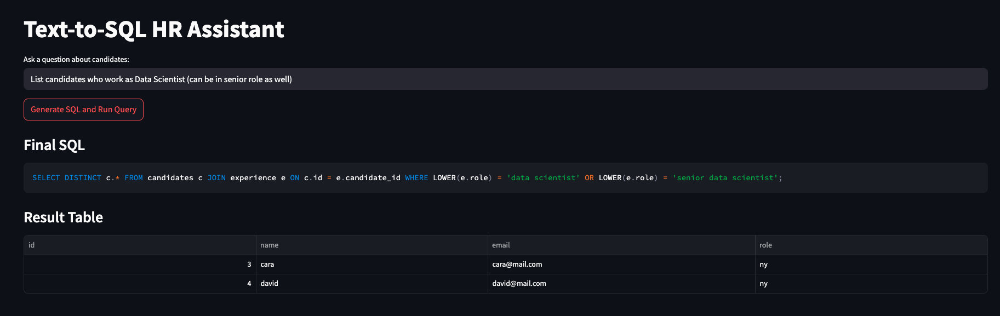

# Text2SQL Multi-Agent System

**Text2SQL Multi-Agent** is a small demonstration of how a group of simple agents can cooperate to translate natural language questions into executable SQL. It takes inspiration from larger multi‑agent frameworks such as *ActiveRAG Next* and applies the same modular approach to converting HR‑style queries into DuckDB/SQLite statements.

## Overview

The system uses LangGraph to orchestrate a graph of specialised nodes:

1. **Rewrite** – creates paraphrases of the user question.
2. **DuckDB Generator** – produces SQL candidates using a local Llama model.
3. **GPT Generator** – produces direct and "enhanced" SQL candidates using OpenAI.
4. **Validator** – selects the best query from all candidates.
5. **Executor** – runs the SQL against an in‑memory HR database and attempts an automatic repair if execution fails.

Each node only receives and returns the minimal state it needs, making the flow transparent and easy to modify.

## Running the Demo

Install the dependencies and set your OpenAI API key:

```bash
python3 -m venv .venv
source .venv/bin/activate
pip install -r requirements.txt
export OPENAI_API_KEY=sk-...
```

Start the small Streamlit interface:

```bash
streamlit run app.py
```

Enter a question such as `List candidates with more than 3 years of experience in NY` and observe the generated SQL and returned rows.

## Demo




## Repository Layout

```
app.py          Streamlit front‑end for manual testing
text2sql.py     LangGraph definition and agent implementations
requirements.txt  Minimal dependencies
```

The Python module `text2sql.py` can also be used directly from the command line via `python text2sql.py --question "..."` to print the SQL and results in the terminal.

## License

This project is released under the [MIT License](LICENSE).

